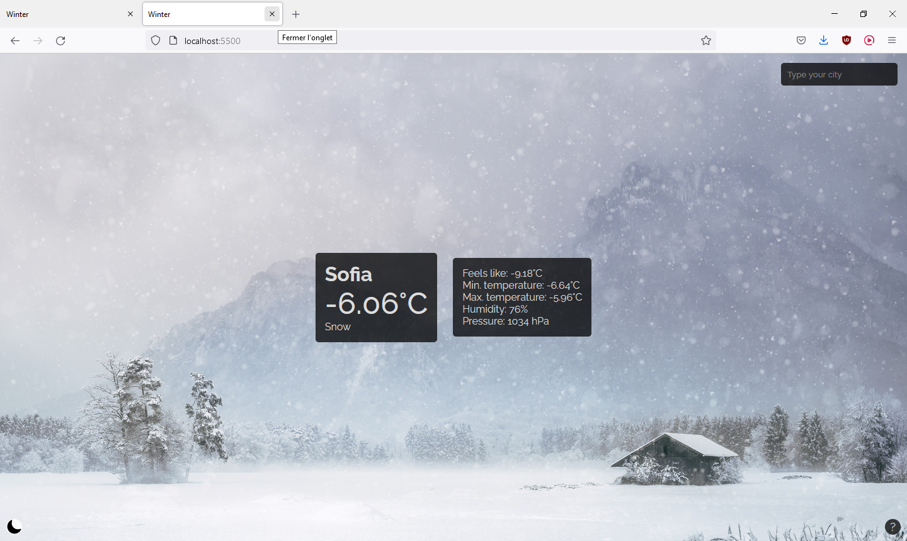

# Winter (I like snow, that's why)
 A simple weather app fetching its data from OpenWeatherMap's API. It has been created while following The Odin Project. Its purpose was to manipulate asynchronous JavaScript and fetch data from an API.

Some info (no particular order):

- It is fully responsive! (It's the first project I designed 'mobile-first')
- You can (if you tap/click on the main temperature) see the temperature in both Celsius and Fahrenheit!
- The background changes according to the weather
- Simple UI
- Dark mode

See it [live on my website](https://bussun.dev/projects/winter)!

## Issues

- I'll add credits to the resources I used asap

## Features to come:
- Replacing absolute units in my CSS

## Screenshots
(To be updated)

